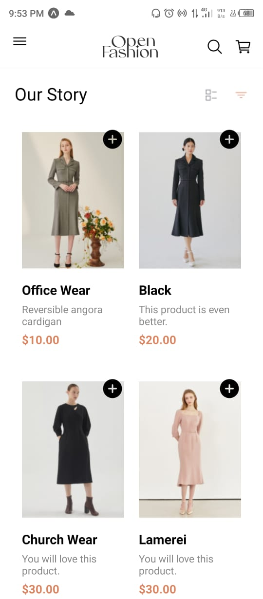
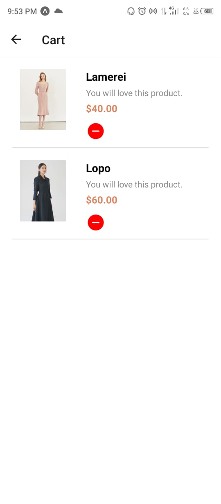

# rn-assignment6-11339613

This is a simple e-commerce app built with React Native. The app displays a list of products, allows users to add products to a cart, and view and remove products from the cart. The app uses `AsyncStorage` for data persistence.

# Design Choices

## 1. Navigation
The app uses react-navigation for handling navigation between screens. The main navigation structure consists of a stack navigator:

### HomeScreen: 
Displays a list of products.

### CartScreen: 
Displays the products added to the cart.

## 2. User Interface
The user interface is designed to be simple and intuitive.

### HomeScreen: 
Displays products in a grid layout, two products per row. Each product includes an image, name, description, and price. A "plus" icon is overlayed on the product image for adding the product to the cart.

### CartScreen: 
Displays products added to the cart in a list format. Each item includes an image, name, description, and price, along with a "remove" icon to remove the product from the cart.

## 3. Icons
The app uses Ionicons for icons. The "add to cart" button is represented by a "plus" icon overlayed on the product image in the HomeScreen. In the CartScreen, a "remove" icon is used to remove items from the cart.

## 4. Data Storage
The app uses AsyncStorage to persist the cart data. This allows the cart data to be saved even when the app is closed or refreshed.

# Implementation Details

## 1. HomeScreen
The `HomeScreen` component displays a grid of products. Each product includes an image, name, description, and price. A "plus" icon is overlayed on the product image for adding the product to the cart.

`const addToCart = async (product) => {
  const updatedCart = [...cart, product];
  setCart(updatedCart);
  await AsyncStorage.setItem('cart', JSON.stringify(updatedCart));
};`

The `addToCart` function updates the cart state and persists the updated cart to `AsyncStorage`.

## 2. CartScreen
The `CartScreen` component displays the products added to the cart. Each product includes an image, name, description, and price, along with a "remove" icon to remove the product from the cart.

`const removeFromCart = async (product) => {
  const updatedCart = cart.filter((item) => item.id !== product.id);
  setCart(updatedCart);
  await AsyncStorage.setItem('cart', JSON.stringify(updatedCart));
};`

The `removeFromCart` function updates the cart state and persists the updated cart to `AsyncStorage`.

## 3. Data Persistence
The `useEffect` hook is used to load the cart data from `AsyncStorage` when the component mounts.

`useEffect(() => {
  const loadCart = async () => {
    const cartData = await AsyncStorage.getItem('cart');
    if (cartData) {
      setCart(JSON.parse(cartData));
    }
  };
  loadCart();
}, []);`

This ensures that the cart data is loaded and set to the cart state when the app is launched.

# Getting Started
To run the app, follow these steps:

## Clone the repository:

`git clone https://github.com/your-repo/e-commerce-app.git`

## Navigate to the project directory:

`cd e-commerce-app`

## Install dependencies:

`npm install`

## Start the app:

`npm start`

# Screenshots

